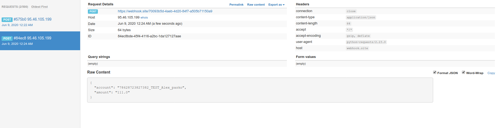

# test task "Платеж"


##### Установка

Python3 должен быть уже установлен.
Для установки зависимостей:
( Создавал данное приложение в python3.8 .В окружении с python ниже 3.6 могут быть ошибки)
```
pip3 install -r requirements.txt
``` 
##### Настройка
```
python3 manage.py migrate

```
```
python3 manage.py createsuperuser

```
Для создания тестовых пользователей и платежей выполните:

```
python3 manage.py create_test_payments
```
#### Запуск
```
python3 manage.py runserver
```
##### Использование
Авторизоваться в админке супер пользователем либо фейковым.
У фейковых пользователей установлен пароль " 123test123 "
Для создания выплаты через форму перейти http://localhost:8000/

Тест запроса на выплаты возвращал 404 статус (https://webhook.site/36693e00-8f59-4f7b-9a85-1d1e7ddde4d4) заменил на  
"https://webhook.site/70093b5d-4aeb-4d20-84f7-a505b71150a9"


